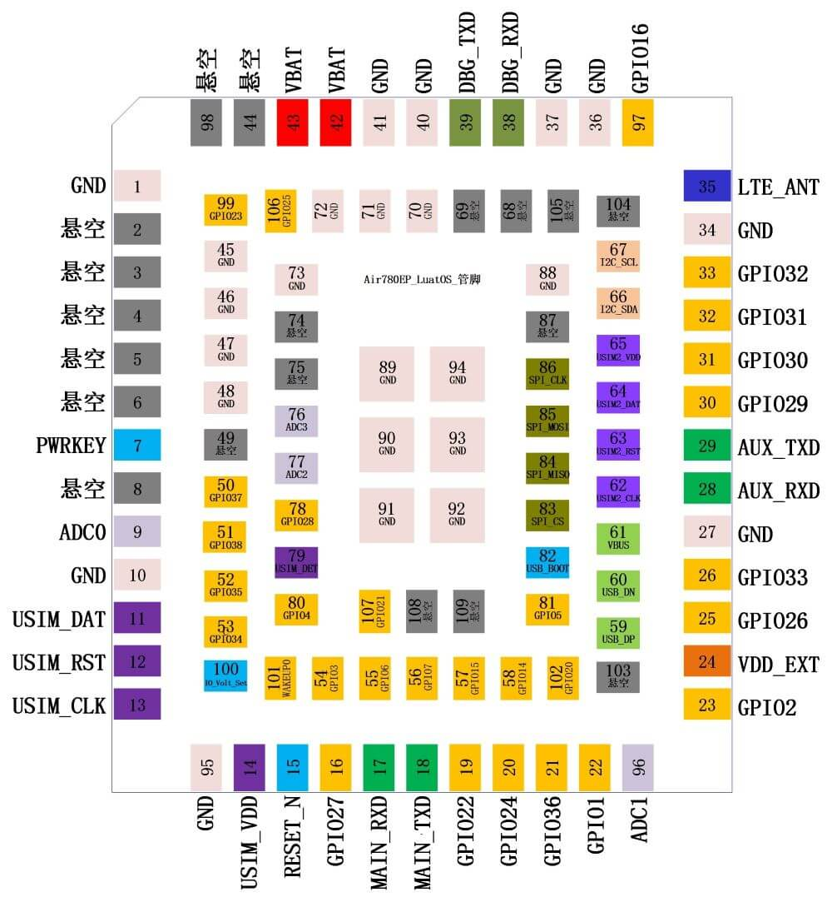

## Air780EP 说明

### 官方文档
1. Air780EP 说明：https://docs.openluat.com/air780ep/
2. AT 固件说明：https://docs.openluat.com/air780ep/at/app/at_command/
3. LuatOS 脚本开发：https://docs.openluat.com/air780ep/luatos/app/
4. LuatOS 官方教程：https://docs.openluat.com/luatos_lesson/

### 设备图片

### 设备特点

Air780EP 是一款基于 EC618 芯片的 4G LTE Cat.1 通信模组，具有以下特点：

- 支持 LTE-FDD、LTE-TDD、GSM/GPRS/EDGE 网络
- 集成 GPS/北斗定位功能
- 支持 LuatOS 脚本开发，开发便捷
- 低功耗设计，适合物联网应用

### 扩展 I2C OLED 屏接线

| OLED | Air780EP |
| --- | --- |
| VCC | 3.3V |
| GND | GND |
| SCL | GPIO 30 |
| SDA | GPIO 29 |

### 与 Air780E 的区别

Air780EP 和 Air780E 均基于 EC618 平台，大部分 LuatOS 脚本程序通用，但需注意以下区别：

| 特性 | Air780EP | Air780E |
| --- | --- | --- |
| 封装 | SMD | SMD |
| 价格 | 较低 | 稍高 |
| 固件兼容性 | 需使用 Air780EP 固件 | 需使用 Air780E 固件 |

### 示例工程

本仓库提供的示例工程均支持 Air780EP：

- `lbsLoc2/`：基站定位示例
- `I2cShowTime/`：基于软件 I2C 的 OLED 时钟显示
- `U8g2ShowTime/`：基于 u8g2 库的 OLED 时钟显示